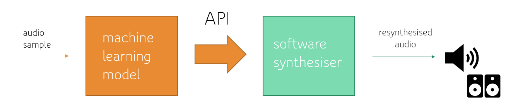

# hammond

## overview

Let's talk about sound matching through _automatic synthesiser programming_, or ASP for short. You have a digital audio sample (wav, mp3, etc.) of a sound and you want to program a synthesiser to reproduce this sound—what parameters should you set across the synth? ASP renders this a machine learning problem: you give an agent the audio sample and it predicts the synth parameters to approximate the sound.

[Yee-King, Fedden and d'Inverno (2018)](https://ieeexplore.ieee.org/abstract/document/8323327) is a good primer on the topic. However, their experiment is limited to target sounds that originate from the synth being programmed (the _intra-domain problem_ in sound matching) as opposed to sounds originating from a foreign source, like a distinct instrument (the _cross-domain problem_). The latter is seemingly a gap in the literature, which can be inferred for two major reasons: i) modelling real instruments is a highly complex and disparate problem (see _physical modelling synthesis_), unsolved by common synth architectures, and ii) because the optimal approximation of a foreign target sound for a given synth is unknown (i.e. there's no technical baseline), evaluating the agent's performance isn't straightforward.

**Which brings us to why _hammond_ exists!** For my undergraduate thesis, I eventually opted to investigate the cross-domain problem and contribute some preliminary results in this area. To achieve this, I came up with the idea of resynthesising recorded samples of a [Hammond organ](https://en.wikipedia.org/wiki/Hammond_organ) on some parameterised system mimicking the instrument. _(Could this system have been a VST? Yes. Is it? No!)_

## motivation

So... why a Hammond organ? As mentioned, a barrier to investigation in the cross-domain problem is producing a system that can **effectively** model the acoustics of the sampled instrument or source. You wouldn't get very far recreating piano samples on a subtractive synth, for example. Noting that a Hammond (more generally, a tonewheel organ) is fundamentally an additive synthesiser was convenient to derive a technically simple, no-cost methodology: build and apply a crude model of a Hammond using standard DSP components (oscillators, filters, mixers, etc.) which would be widely found through audio programming libraries.

The obvious alternative would be to use a professional VST emulation of a chosen instrument. This is a more costly methodology in multiple senses though: needing to build ([at least, on Windows](https://github.com/fedden/RenderMan)) and interface with a VST host program in C++ and possibly purchasing such an off-the-shelf VST.

## design & implementation

The details of implementation are summarised through **Figures 3.1** and **3.3** (**p12** and **p17**, respectively) in `COMP3200 Final Report.pdf`. Figure 3.1 gives the implementation of the ASP system, and Figure 3.3 gives the model architecture of the Hammond emulation.

The full report serves as a complete layman overview of the project, from the theory of sound synthesis and literature of ASP, through to the project's design, development and experimental results. The table of contents allows for easy navigation through the report. _NB: I've since learnt how to use IEEE citation properly. :joy:_

## further ideas (free!)

Towards further progress into the cross-domain problem in sound matching, here are some suggestions on improving and/or extending this work:

- Use a VST emulation and corresponding audio samples of a chosen source/instrument. (Amazingly, [here's a free one for the Hammond B3 organ](https://www.lostin70s.com/plugins/HaNonB70), which can be applied with the audio samples in this repo.) If you have a Linux system, you can further check out [this very convenient testbed](https://github.com/yeeking/deepvstprogrammers) made available for ASP with VSTs.

- Unlike most instruments, you can achieve a _reasonable_ approximation of [wind](https://www.soundonsound.com/techniques/synthesizing-wind-instruments) and [brass](https://www.soundonsound.com/techniques/synthesizing-brass-instruments) instruments through modular subtractive synthesis. If you don't want to work with VSTs, you can maintain a similar approach to this project and script a rough emulation of these acoustic systems for an investigation.

- If working with recorded audio samples, you might be stuck with audio artifacts like reverb. (A good-quality recording will minimise these artifacts, but they're ultimately a consequence of physics.) Recorded samples could hence benefit from audio preprocessing, e.g. dereverberation based on the estimated room acoustics or impulse response.
